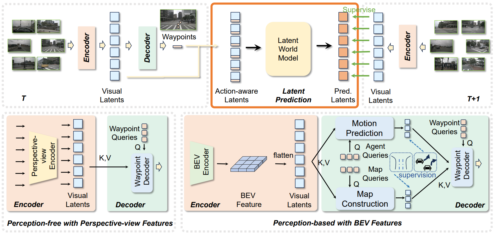
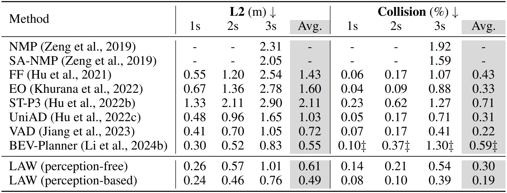
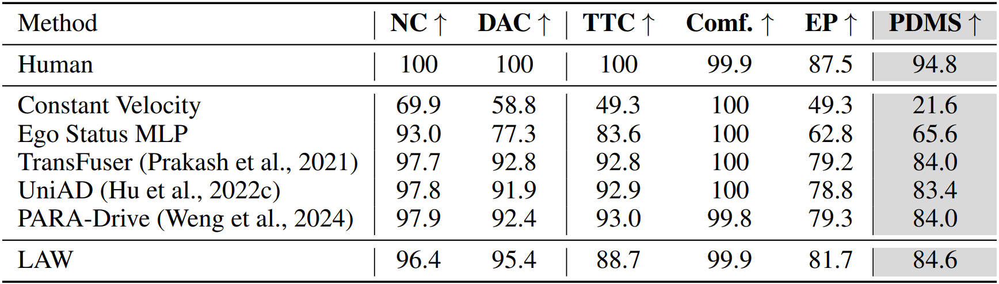
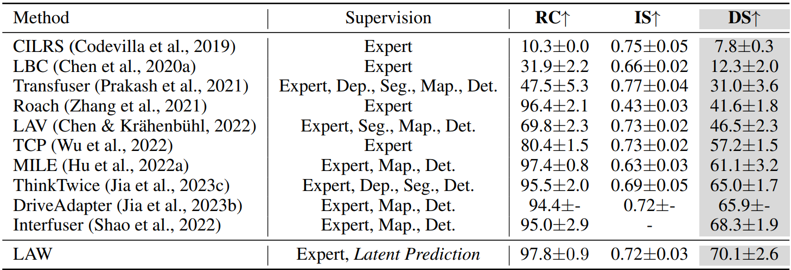
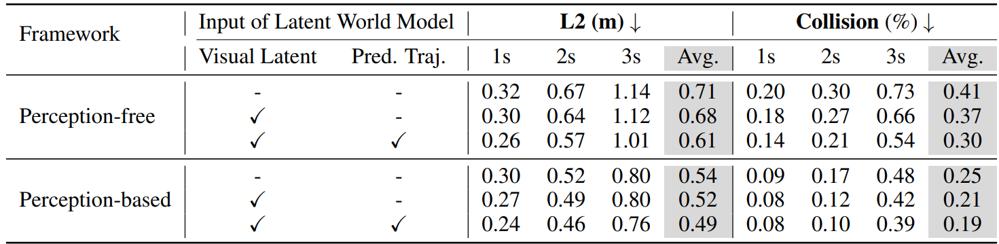

[LAW: Enhancing End-to-End Autonomous Driving with Latent World Model]("https://arxiv.org/abs/2406.08481")

# Introduction
### 기존 E2E의 발전 과정
1. 초기의 플래너는 인지 모델의 결과를 후처리해서 사용
2. E2E 플래너는 정보 손실을 줄이기 위해 센서 데이터로부터 직접 scene feature를 추출
   - 본 논문에서는 scene feature representation을 향상시키기 위한 방법을 제안

### Feature representation을 향상시키기 위한 방법
   - Self-supervised 학습은 feature representation을 향상시키기 위한 방법으로써 많이 사용되었음 (BERT, MAE)
   - [Video prediction에서 다음 frame을 예측함으로써 representation을 향상시키는 방법]("https://arxiv.org/abs/2008.01065")을 참고하여 자율주행에 적합한 방법을 제안
      - 자율주행에서는 sequential한 비디오가 입력으로 들어오기에 temporal 정보가 중요함
      - Ego action과 current state을 고려하여 future state를 예측
   - 기존에 다음 시점의 이미지를 생성하는 Diffusion 기반의 World model이 존재했지만, 이미지 생성에 수 초가 걸림
      - 미래 latent future를 예측하고 이러한 문제를 해결
      - 참고했다는 Video prediction의 모델은 다른 영상, 다른 시간과의 contrastive learning을 통해 상대적인 비교만 진행하기에 미래 시점의 feature로의 supervision이 좀 더 합당한거 같은데 직접적인 L2 Loss는 모델 학습 초기의 불안정 feature space에서 학습을 오히려 방해하진 않을지 의문

# Methodology
이미지 feature로부터 visual latent를 생성하여 이를 k,v로 하는 디코더를 통해 wayp ㅇoint를 예측하는 perception-free 방식과 BEV feature를 생성하고 이를 visual latent로써 활용하여 moition predction과 map construction도 같이 진행하는 perception-based 방식을 제안

### Perception-free: 
1. Img feature에 3d embedding을 추가
2. 각 view 별로 num_token개의 learnable query를 생성하여 Img feature를 k,v로 하는 Transformer decoder를 통해 visual latent를 생성
3. Learnable waypoint query를 생성하여 visual latent를 k, v로 하는 Transformer decoder와 MLP를 통해 waypoint 예측 (L1 loss)
4. waypoint를 flatten하고 num_token만큼 repeat해서 visual latent을 concat하고 MLP하여 action-aware latent를 생성(sinusoidal embedding도 안하는데 이게 더 낫나?)
5. Action-aware latent를 Transformer decoder에 Q, K, V로 입력해서 next latent를 예측
6. 과거 img로 예측한 현재 visual latent와 현재 시점의 visual latent 간의 MSE Loss
### Perception-based (코드 아직 미제공공):
1. BEVFormer를 통해 BEV feature를 생성하고 flatten하여 visual latent로 활용
2. Agent query와 visual latent를 cross attention해서 agent trajectory를 예측
3. Map query와 visual latent를 cross attention해서 vectorized map 예측
4. Waypoint query와 디코딩된 agent query와 map query의 cross attention해서 ego trajectory 예측
   
# Implementation Details
#### nuScenes: 
- Swin-T tiny
- Image shape 800x320
- AdamW with Cosine annealing lr 5e-5 batch size 8 weight decay 0.01
- Perception 모델은 Encoder와 perception head에 대해 48 epoch 먼저 학습하고, waypoint와 latent world model을 추가해서 12 epoch 추가 학습
  - 빠른 수렴을 위해 latent world model을 deformable self-attention으로 수정
#### NAVSIM: 
- TransFuser와의 비교를 위해 ResNet34 backbone에 20 epoch 학습
- Image shape 640x320
- Adam, lr 1e-4, batch size 32
#### CARLA:
- ResNet34 backbone에 TCP head 추가
- Image shape 900x256
- Adam, lr 1e-4, weight decay 1e-7
- 60 epoch, batch size 128, 30 epoch 이후 lr / 2

# Experiments
### Result on nuScenes
Perception-free, perception-based 간의 성능 차이가 유의미하게 존재

### Result on NAVSIM test set

### Result on CARLA Town05 Long

### Ablation study of latent prediction on nuScenes
